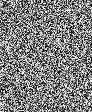

# att_faces-features-plotting, fooling
plot features with PCA and T-SNE on TensorBoard  
make fooling images of dsearch, logreg model  
  
dataset: http://www.cl.cam.ac.uk/research/dtg/attarchive/facedatabase.html 

dsearch on pixel feats (112 x 92)  

logreg on pixel feats (112 x 92)  
